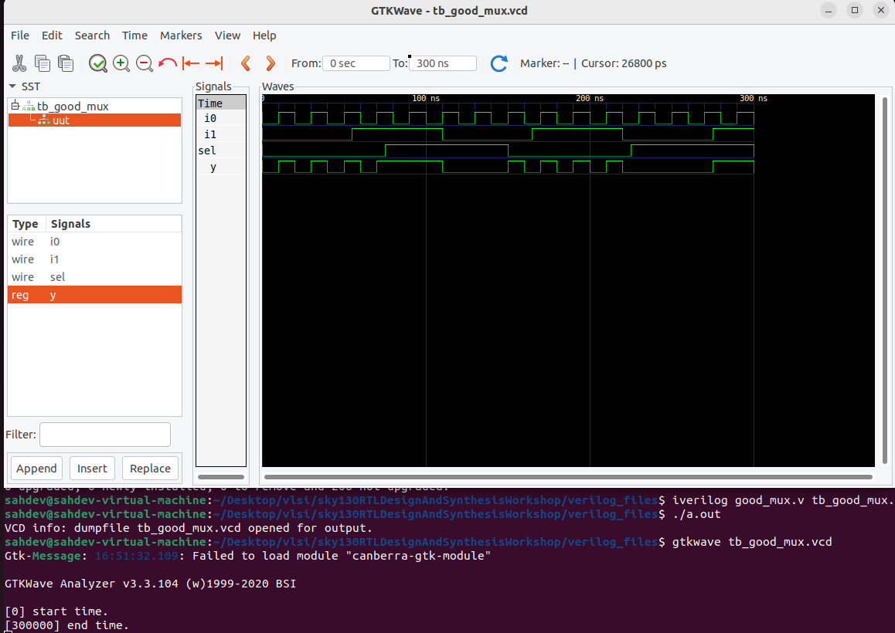
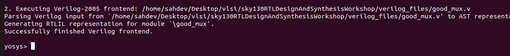

# Day 1: Verilog RTL Design & Synthesis 🚀

Welcome to Day 1! Today, you'll learn the fundamentals of digital design with **Verilog** and begin using open-source tools like **Icarus Verilog (iVerilog)** for simulation and **Yosys** for synthesis.

---

## 🔬 Tool Setup & Simulation

* **Verilog Concepts:** A **simulator** checks your design's functionality. The **design** is your Verilog code, and the **testbench** is the code that tests it.

* **iVerilog Installation:** Install the simulator using the package manager.
    ```shell
    sudo apt install iverilog
    ```
    

* **GTKWave Installation:** Install the waveform viewer to visualize simulation results.
    ```shell
    sudo apt install gtkwave
    ```
    

* **Simulation Flow:** Compile your design and testbench, run the simulation, and view the `.vcd` file in GTKWave.

    * **Compile:** `iverilog good_mux.v tb_good_mux.v`
    * **Run:** `./a.out`
    * **View Waveform:** `gtkwave tb_good_mux.vcd`
    

---

## ⚡ Logic Synthesis with Yosys

* **Yosys Introduction:** Yosys is a powerful synthesis tool that converts your Verilog code into a gate-level netlist using a technology library.

* **Synthesis Flow:**
    1.  **Start Yosys:** Begin the interactive Yosys session.
        ```shell
        yosys
        ```
        

    2.  **Read Liberty Library:** Import the technology library (`.lib` file) to define the available hardware cells.
        

    3.  **Read Verilog Code:** Load your design's Verilog file into Yosys.
        

    4.  **Perform Synthesis:** Run the `synth` command to convert the design into a logic circuit.
        
        

    6.  **Technology Mapping:** Use the `abc` command to map the logic to the specific standard cells from your library.
        

    7.  **Visualize the Netlist:** Use the `show` command to generate a graphical representation of the final gate-level netlist.
        * **Result:** The `2-to-1 multiplexer` is implemented using a single `sky130_fd_sc_hd__mux2_1` cell.
        

---

