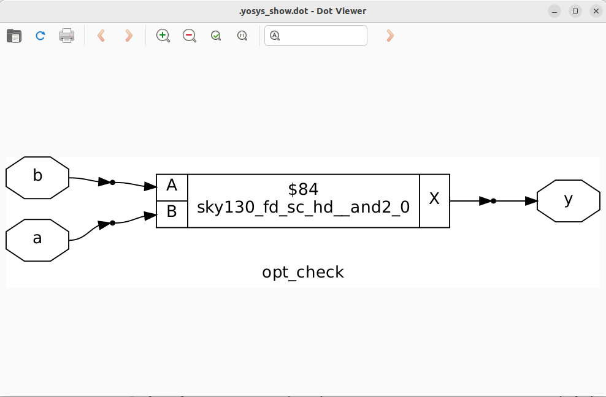
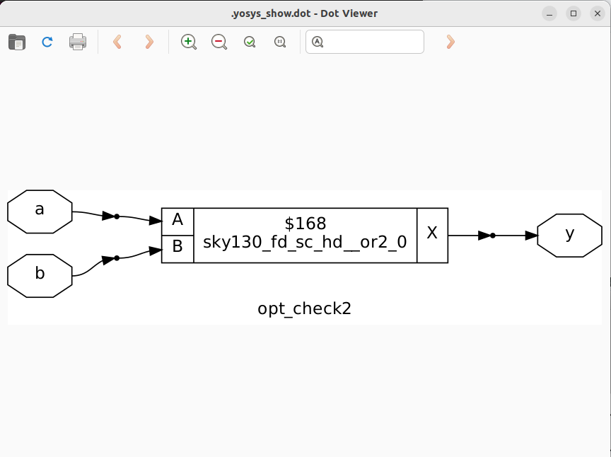
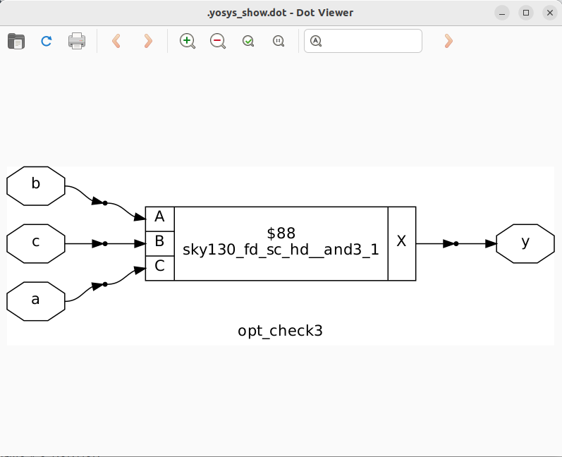
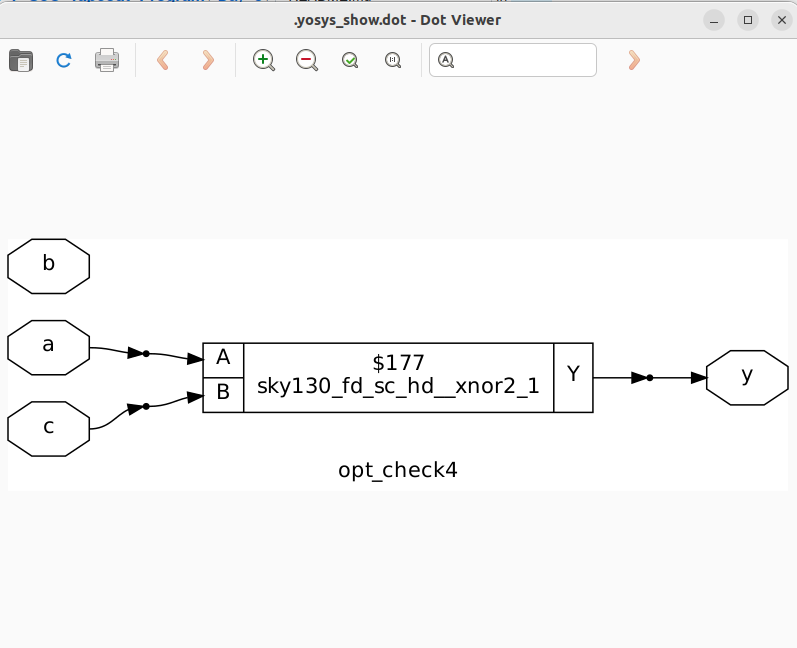

# Day 3: Combinational and Sequential Optimization

Welcome to Day 3 of this workshop! Today we discuss optimization of combinational and sequential circuits, introducing techniques to enhance efficiency and performance.

---

## 1. Constant Propagation

In VLSI design, constant propagation is a compiler optimization technique used to replace variables with their constant values during synthesis. This can simplify design and enhance performance.

**How it works:**  
Imagine you have a variable, say A, that you know will always be, for example, 5. Instead of having the circuit calculate A every time it's used, constant propagation directly substitutes the value 5 everywhere A appears. This is done during the synthesis stage, where the high-level design is translated into a physical circuit layout.

**Why It's Useful:**
- **Simplification:** By replacing variables with fixed values, you can eliminate unnecessary logic gates and components that were used to compute or store that variable. This leads to a smaller, less complex design.
- **Performance:**  A simplified circuit with fewer gates often means a shorter signal path. This can lead to faster operation, as the signal doesn't have to travel through as many components. It's a quick way to get a more efficient circuit without changing the core functionality.
- **Resource Optimization:** Fewer gates or flip-flops required.

---

## 2. State Optimization

State optimization refines finite state machines (FSMs) to improve efficiency in IC design. It reduces the number of states, optimizes encoding, and minimizes logic.

### In Simple Words:
State optimization in IC design is like tidying up a messy flowchart for a circuit. It streamlines the "steps" a circuit follows to make it smaller, faster, and use less power.

### How It's Done:
Think of a circuit's behavior as a sequence of steps, or "states." State optimization simplifies this sequence to make the circuit smaller and faster. It's typically done through the following steps:

1.  **State Reduction**: This step is about getting rid of redundant steps. If two different states in the flowchart lead to the same result and behave identically, they're merged into a single state. This shrinks the overall number of states the circuit needs to keep track of.

2.  **State Encoding**: Once you have the fewest number of states possible, you assign them a binary code (like `00`, `01`, `10`, etc.). Choosing the right codes can make the logic that connects the states much simpler, which in turn reduces the number of components needed.

3.  **Logic Minimization**: After encoding, the next step is to simplify the Boolean equations that control the circuit's transitions between states. This is done using techniques like Karnaugh maps or specialized software, resulting in a more compact and efficient circuit.

By following these steps, designers create a circuit that's smaller, faster, and uses less power.

---

## 3. Cloning

Cloning, also known as module replication or cell duplication, is like adding more checkout lines at a grocery store when one cashier is overwhelmed. In a digital circuit, if a single logic gate or a larger functional block is overloaded and causing a delay, you can make an identical copy of it. This new, "cloned" cell then shares the workload with the original, which helps to speed up the circuit.

**How it’s done:**
- **Identifying the Bottleneck:** The first step is to pinpoint where the problem lies. Designers use Static Timing Analysis (STA) tools to find the critical path, which is the longest delay path in the circuit. If a particular cell on this path is driving too many other cells (a high fan-out) or is connected to a very long wire, it becomes a candidate for cloning.
  
- **Duplicating the Logic:** Once the target cell or module is identified, a precise copy is created. This could be a simple buffer or inverter, or even a more complex register or multiplexer. The original and cloned cells are now functionally identical.

- **Redistributing the Load:** This is the most critical step. The original connections from the single cell are now intelligently split between the original and the newly cloned cell. For example, if the original cell was driving eight other inputs, the new configuration might have the original cell driving four of them and the cloned cell driving the other four. This dramatically reduces the fan-out on each individual driver, which in turn reduces the electrical load and speeds up the signal transition.

- **Physical Placement and Routing:** The physical layout of the cloned cell is crucial. The new cell is placed close to the inputs it now drives. This shortens the wire length between the driving cell and its receiving cells. Shorter wires have less parasitic resistance and capacitance, which further improves signal speed and reduces dynamic power consumption.

- **Verification:** After the design changes are made, the entire process is verified using the same analysis tools. The design is checked to ensure that the critical path's delay has been reduced and that the circuit now meets its timing requirements (e.g., operates at the desired clock frequency). Power analysis is also performed to confirm that the optimization didn't unintentionally increase power consumption in other parts of the design.

---

## 4. Retiming

Retiming is a design optimization technique that improves circuit performance by repositioning registers (flip-flops) without changing functionality.

**How it is done:**
1. **Graph Representation:** The digital circuit is first modeled as a directed graph. The logic gates are the nodes, and the registers are the edges that connect them. This representation allows designers to mathematically analyze the delays and register locations.
2. **Register Repositioning:** Using specialized algorithms, registers are moved across logic gates. A key rule is that you can move a register from the output of a gate to all of its inputs, or vice versa. For example, a single register at the output of an AND gate can be replaced by two registers, one at each of its inputs. The total number of registers along any given path remains the same, so the circuit's functionality is preserved.
3. **Constraints Analysis:** Before and after any movement, timing and functional constraints are analyzed. The goal is to ensure the timing equivalence of the new circuit, meaning it produces the same outputs with the same input sequence, just potentially at a faster rate. The design must also be checked to make sure it doesn't violate any setup or hold time requirements.
4. **Optimization:** The primary goal of retiming is to minimize the clock period. By shifting registers, the delay between any two sequential registers is balanced, eliminating long, slow paths (critical paths) and allowing the circuit to operate at a higher frequency. It can also be used to reduce power consumption by minimizing the number of registers in the design.

---

## 5. Labs on Optimization

### Lab 1

Below is the Verilog code for Lab 1:

```verilog
module opt_check (input a , input b , output y);
	assign y = a?b:0;
endmodule
```

**Explanation:**
- `assign y = a ? b : 0;` means:
  - If `a` is true, `y` is assigned the value of `b`.
  - If `a` is false, `y` is 0.

Follow the steps from Day 1 Synthesis Lab and add the following between `abc -liberty` and `synth -top`:
```shell
opt_clean -purge
```



---

### Lab 2

Verilog code:

```verilog
module opt_check2 (input a , input b , output y);
	assign y = a?1:b;
endmodule
```

**Code Analysis:**
- Acts as a multiplexer:
  - `y = 1` if `a` is true.
  - `y = b` if `a` is false.



---

### Lab 3

Verilog code:

```verilog
module opt_check3 (input a , input b, input c , output y);
assign y = a?(c?b:0):0;
endmodule
```

**Functionality:**  
2-to-1 multiplexer; `y = a ? 1 : b` (outputs `1` when `a` is true, otherwise `b`).



---

### Lab 4

Verilog code:

```verilog
module opt_check4 (input a , input b , input c , output y);
 assign y = a?(b?(a & c ):c):(!c);
 endmodule
```

**Functionality:**
- Three inputs (`a`, `b`, `c`), output `y`.
- Nested ternary logic:
  - If `a = 1`, `y = c`.
  - If `a = 0`, `y = !c`.
- Logic simplifies to:  
  `y = a ? c : !c`



---

### Lab 5

Verilog code:

```verilog
module dff_const1(input clk, input reset, output reg q);
always @(posedge clk, posedge reset)
begin
	if(reset)
		q <= 1'b0;
	else
		q <= 1'b1;
end
endmodule
```

**Functionality:**
- D flip-flop with:
  - Asynchronous reset to 0
  - Loads constant `1` when not in reset


---

### Lab 6

Verilog code:

```verilog
module dff_const2(input clk, input reset, output reg q);
always @(posedge clk, posedge reset)
begin
	if(reset)
		q <= 1'b1;
	else
		q <= 1'b1;
end
endmodule
```

**Functionality:**
- D flip-flop always sets output `q` to `1` (regardless of reset or clock).


---

## Summary
- **Focus:** Optimization techniques for combinational and sequential circuits in digital design, with practical Verilog labs.
  
- **Topics Covered:**
  1. **Constant Propagation:** Replacing variables with constant values to simplify logic and improve circuit efficiency.
  2. **State Optimization:** Reducing states and optimizing encoding in finite state machines to use less logic and power.
  3. **Cloning:** Duplicating logic cells/modules to improve timing and balance load.
  4. **Retiming:** Repositioning registers in a circuit to enhance performance without altering its function.

- **Labs:** Six practical Verilog labs illustrate these concepts, including examples of combinational logic optimizations and D flip-flop behaviors, each with code snippets and output images.


